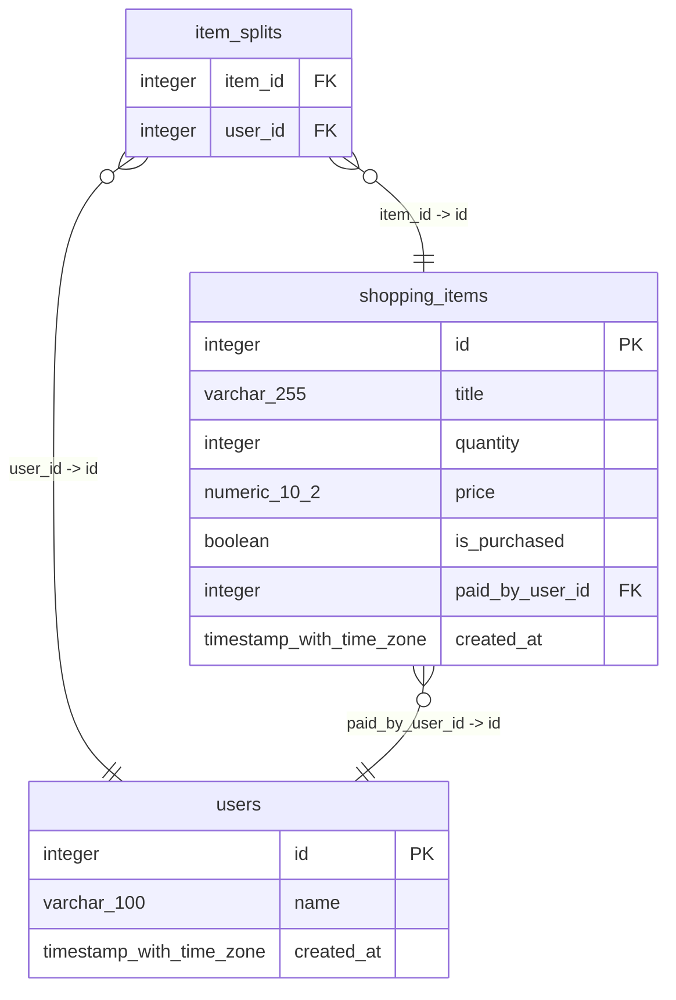

# TP2
Script de ejecución: _**`ejecutar.sh`**_


#### Para ejecutar la app, utilizar el siguiente comando:
> ```bash
> chmod +x ejecutar.sh 
>
> ./ejecutar.sh
> ```


## Dependencias:
- [Docker](https://www.docker.com/)



