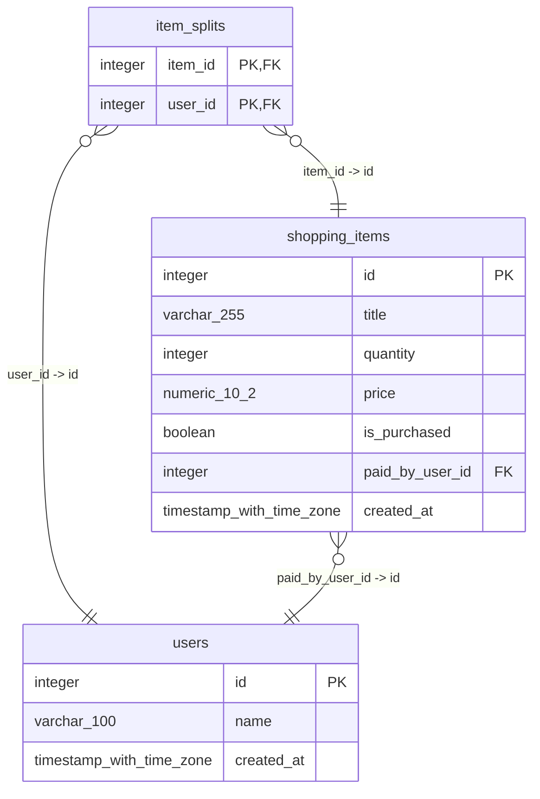

```mermaid

classDiagram
direction BT
class item_splits {
   integer item_id
   integer user_id
}
class settlements {
   integer payer_id
   integer receiver_id
   "numeric(10,2)" amount
   "timestamp with time zone" created_at
   integer id
}
class shopping_items {
   "varchar(255)" title
   integer quantity
   "numeric(10,2)" price
   boolean is_purchased
   integer paid_by_user_id
   "timestamp with time zone" created_at
   integer id
}
class users {
   "varchar(100)" name
   "timestamp with time zone" created_at
   integer id
}

item_splits  -->  shopping_items : item_id:id
item_splits  -->  users : user_id:id
settlements  -->  users : payer_id:id
settlements  -->  users : receiver_id:id
shopping_items  -->  users : paid_by_user_id:id


```
