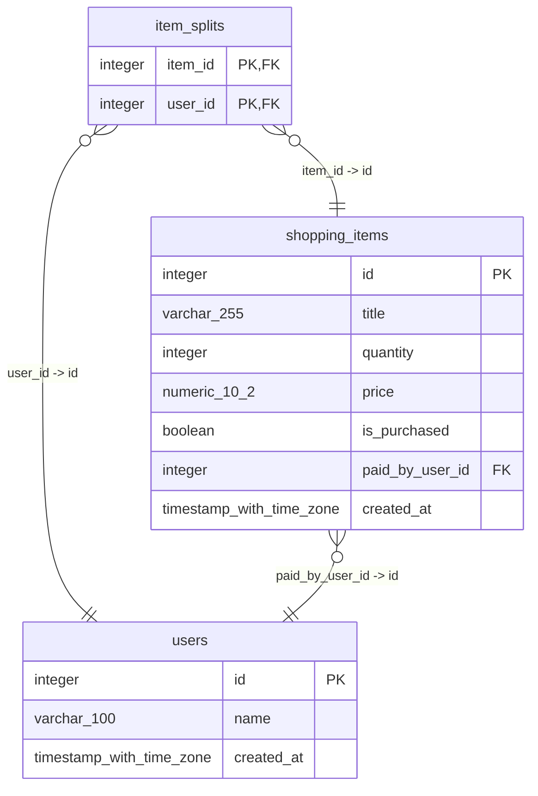

```mermaid

erDiagram

    users {
        integer id PK
        varchar_100 name
        timestamp_with_time_zone created_at
    }

    shopping_items {
        integer id PK
        varchar_255 title
        integer quantity
        numeric_10_2 price
        boolean is_purchased
        integer paid_by_user_id FK
        timestamp_with_time_zone created_at
    }

    item_splits {
        integer item_id PK, FK
        integer user_id PK, FK
    }

    item_splits }o--|| shopping_items : "item_id -> id"
    item_splits }o--|| users : "user_id -> id"
    shopping_items }o--|| users : "paid_by_user_id -> id"
```
