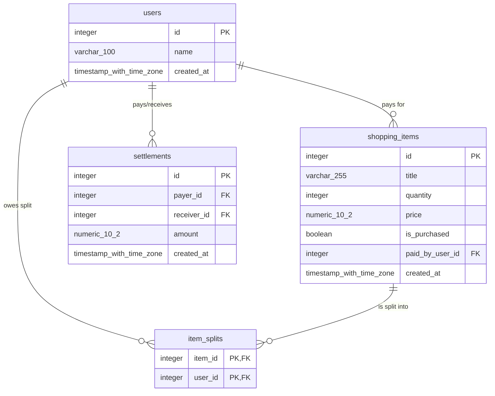

```mermaid
erDiagram
    users {
        integer id PK
        varchar_100 name
        timestamp_with_time_zone created_at
    }

    shopping_items {
        integer id PK
        varchar_255 title
        integer quantity
        numeric_10_2 price
        boolean is_purchased
        integer paid_by_user_id FK
        timestamp_with_time_zone created_at
    }

    item_splits {
        integer item_id PK, FK
        integer user_id PK, FK
    }

    settlements {
        integer id PK
        integer payer_id FK
        integer receiver_id FK
        numeric_10_2 amount
        timestamp_with_time_zone created_at
    }

    %% Relationships
    users ||--o{ shopping_items : "pays for"
    users ||--o{ item_splits : "owes split"
    users ||--o{ settlements : "pays/receives"
    shopping_items ||--o{ item_splits : "is split into"


```
